# AI Builder - Customer satisfaction starter kit

This document describes the *customer satisfaction* starter kit. This kit demonstrates how AI can enhance and guide your business decisions, with minimal effort and no or low coding skills required to create, publish, and use AI models.

## Overview

This document will guide you through:

* Installation of the starter kit.
* Population of the analytical entities.
* Actions to create and publish your model.
* Actions to customize Power Apps to view the model results.

## What’s in the starter kit?

The customer satisfaction starter kit includes:

* Common Data Service entities
* Sample data
* Power Automate flows
* Dataflows
* PowerApps canvas application

### Common Data Service entities

The following illustration shows the Common Data Service entities referenced in the starter kit. The illustration communicates the direct relationships between entities and the boundary that separates the entities as transactional or analytical. Parts of this diagram will be referenced throughout this document to highlight specific components of the starter kit.

> [!div class="mx-imgBorder"]
> 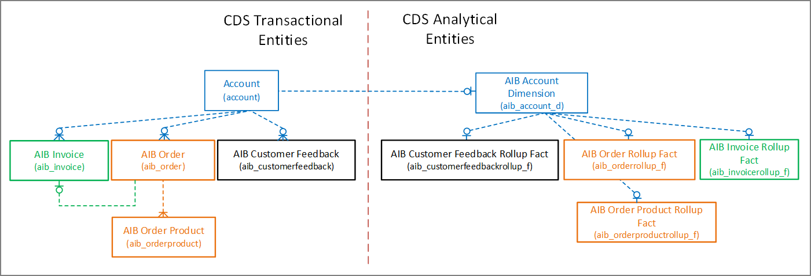

The starter kit entities listed below are identified first by their display name followed by the entity’s physical name in square brackets. See the [Appendix](#starter-kit-cds-entity-fields) for additional details.

### Transactional entities

Transactional entities are those entities that are typically needed to run the day-to-day business such as capturing business transactions (e.g. orders, payments, usage, etc.).

* **Account** [account] - This is the standard account entity that ships with CDS being leveraged for this starter kit.
* **AIB Customer Feedback** [aib_customerfeedback] - Comments customers submit regarding their experience with the seller’s business.

* **AIB Order** [aib_order] - Transactions identifying customer purchases. An order includes one or more products (offers) which are detailed in the order product entity.

* **AIB Order Product** [aib_orderproduct] - Identifies the customer’s ordered products.

  > Note: The **Product** entity is not in scope for this starter kit, therefore only the product’s identifier is included in this entity.

* **AIB Invoice** [aib_invoice] - Transaction identifying request for payment to the customer for a given order. In the sample data provided, the invoice is created one day after the ordered products are delivered.

### Analytical Entities

Analytical entities reflect a transactional entity and are constructed using the transactional entity’s data. There are two types of analytical entities, dimensions and facts.

Dimension entities represent a transactional entity. These dimension entities are not intended to contain measures but instead contain descriptive fields for the purpose to filter related entity records. These entities are primarily used as the starting place to conduct analysis.

Fact entities represent a transactional entity and related to a dimension entity. In this starter kit, these entity types contain aggregated data from their transactional counterpart that is  rolled-up to the related dimension.

In this starter kit, an entity is an analytical type (versus a transactional type) when the entity’s display name includes ‘dimension’ or ‘fact’.

Not all business problems or opportunities are efficiently solved with the transactional entities. With analytical entities, impact to any transactional system performance can be minimized and optimally managed and as a value proposition provide inclusion of the analytical facts into transactional applications.

The starter kit uses dataflows to populate the analytical entities. The
following analytical entities are included:

* **AIB Account Dimension** [aib_account_d]

  Associated to *Account*, the purpose of this entity is to house analytical business attributes as well as anchor relationships to the analytical fact entities.

* **AIB Customer Feedback Rollup Fact** [aib_customerfeedbackrollup_f]

  Roll-up (aggregation) of *Customer Feedback* data to the Account Dimension.

* **AIB Order Rollup Fact** [aib_orderrollup_f]

  Roll-up (aggregation) of *Order* data by account and associated to the Account Dimension.

* **AIB Order Product Rollup Fact** [aib_orderproductrollup_f]

  Roll-up (aggregation) of *Order Product* data by account and associated to the Account Dimension.

* **AIB Invoice Rollup Fact** [aib_invoicerollup_f]

  Roll-up (aggregation) of *Invoice* data by account and associated to the Account Dimension.

### Option sets
-----------

The customer satisfaction starter kit includes the following option sets.

| **Option set display name** | **Option set physical name** | **Assigned to field(s)**                                                           |
|-----------------------------|------------------------------|------------------------------------------------------------------------------------|
| **Is Happy Customer** *(Yes, No, Neutral, Not Determined)*        | aib_ishappycustomer          | Account Dimension’s **Is Happy Customer** field: aib_account_d.aib_ishappycustomer |

## Sample data

Sample data is provided to populate each of the transactional entities.

| **Transactional Entity** | **Row Count** |
|--------------------------|---------------|
| Account                  | 2,000         |
| AIB Customer Feedback    | 22,460        |
| AIB Order                | 32,396        |
| AIB Order Product        | 60,000        |
| AIB Invoice              | 32,396        |

Power Automate 
---------------

The following Power Automate flows are provided to update either transactional
or analytical entity records.

| **Flow**                                | **Purpose**                                                                                                                |
|-----------------------------------------|----------------------------------------------------------------------------------------------------------------------------|
| AIB Execute Sentiment Analysis Feedback | Calculates each customer feedback’s overall sentiment utilizing AI Builder Sentiment Analysis.                             |
| AIB Update Account Dimension            | Update account dimension entity with the analytical entities’ relationship key and populate the *Is Happy Customer* field. |

Dataflows
---------

The following dataflows are provided to create and update analytical entity
records with the computed and aggregated values based on the transactional
entities.

| **Dataflow**                               | **Purpose**                                  |
|--------------------------------------------|----------------------------------------------|
| AIB Populate Customer Feedback Rollup Fact | Create customer feedback rollup fact records |
| AIB Populate Order Rollup Fact             | Create order rollup fact records             |
| AIB Populate Order Product Rollup Fact     | Create order product rollup fact records     |
| AIB Populate Invoice Rollup Fact           | Create invoice rollup fact records           |

PowerApps Canvas Applications
-----------------------------

The following canvas app is provided.

| **Canvas application**    | **Purpose**                                                                                                                  |
|---------------------------|------------------------------------------------------------------------------------------------------------------------------|
| AIB Customer Satisfaction | Shows each customer’s satisfaction and allows the user to navigate to view the customer’s transactional and analytical data. |

## Business scenario

Bob, Contoso’s marketing director, is planning a new campaign that target offers
to customers based on their level of happiness.

Inside Contoso’s business data, a field does not exist that shows the customer’s
current mood.

To meet his need, Bob takes the following steps that will provide the answer to
his business question.

Bob’s first task is to create a new field, labeling it **Is Happy Customer**, to
store the answer to his question and assigns the values:

| **Value**      | **Meaning**                                                  |
|----------------|--------------------------------------------------------------|
| Yes            | Customer is happy (😊)                                        |
| No             | Customer is not happy (☹)                                    |
| Neutral        | Customer is between happy and not happy (😐)                  |
| Not Determined | Default assignment until customer’s happiness is calculated. |

Bob considered adding this new field to the Account entity, but being mindful
not to cause any negative impact to the transactional systems, decides to create
a new entity, *Account Dimension*, an analytical entity type, to store **Is
Happy Customer**.

#### Progression goals

1. Create new field: **Is Happy Customer**
1. Define valid values: 😊☹😐
1. Create field’s target entity: *Account Dimension*

Bob wants to use AI Builder to build a model to predict the customer’s happiness state, and update the **Is Happy Customer** field with the information. But the
prerequisite to create any prediction model is to provide labeled values,
examples, to train the model. Therefore, Bob will need to update enough **Is
Happy Customer** values (from the default value: *Not Determined* ) required to train
the model.

Knowing the business data, Bob thinks the comments in the *Customer Feedback* is
the best source to understand the heartbeat of Contoso’s customers. The
*Customer Feedback* contains thousands of comments yet no indication informing
the mood of any given comment.

This is where Bob incorporates AI Builder’s sentiment analysis into a Power
Automate flow to calculate each feedback’s overall sentiment.

> [!NOTE] Look at the **AIB Execute Sentiment Analysis Feedback** Power Automate flow to see how Bob created the logic that executes sentiment analysis over the *Subject* and *Feedback* text, resulting in positive, neutral, and negative scores to produce an average score of each. The average scores are put in the calculated field, **Overall Sentiment**, to arrive at a final sentiment. See [Customer Feedback Overall Sentiment – Field Calculation](#customer-feedback-overall-sentiment-field-calculation) for formula details.

The following diagram illustrates Bob’s current progression:

> [!div class="mx-imgBorder"]
> 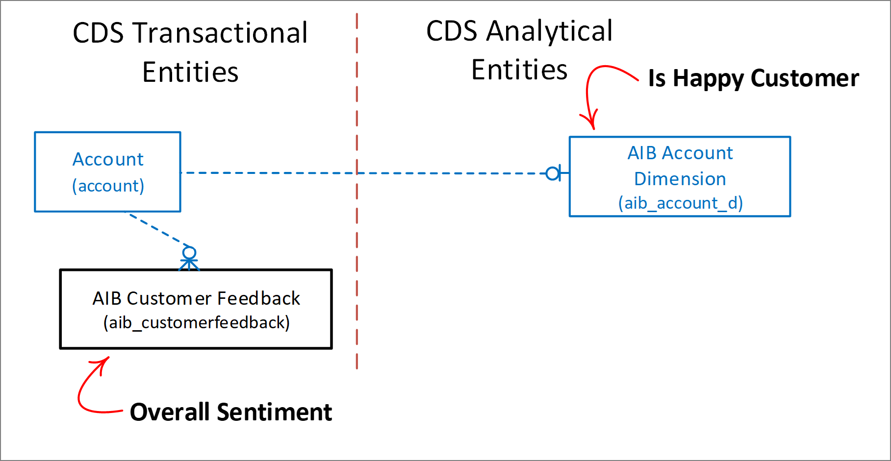

> **Progression goals**

1. Identify labeled data source: Customer Feedback
2. Fix data: Apply AIB sentiment analysis.
3. Fix data: Calculate **Overall Sentiment** [1.0\|0.5\|0.0]

Now that each feedback has been scored with an overall sentiment weight, Bob
creates another analytical entity, *Customer Feedback Rollup Fact* and adds a
relation to the *Account Dimension*. This entity will store aggregation results
applied to selected *Customer Feedback* fields. He creates a dataflow[^2] to
populate the *Customer Feedback Rollup Fact* with aggregated measures one of
which is **Average Sentiment** calculated by summing the *Customer Feedback*
**Overall Sentiment** then dividing the that result by the count of total
*Customer Feedback* rows grouped by account.

> [!NOTE]
>
> * Look at the **AIB Populate Customer Feedback Rollup Fact** dataflow to see how Bob populated the Customer Feedback Rollup Fact entity.With the *Customer Feedback Rollup Fact* populated, using the **Average Sentiment**, Bob creates a *Power Automate* flow to calculate and update each related account’s **Is Happy Customer** with **Yes**, **No**, or **Neutral**.
>
> * Look at the **AIB Update Account Dimension With Analytical Entities** *PowerAutomate* flow to see how Bob updated the *Account Dimension* *Is Happy Customer**.
>
> * The calculation to determine where each customer is classified was made after inspecting the Average Sentiment distribution. As a maker, if using your own business data, consider modifying these thresholds based on the distribution within your environment.

The following diagram illustrates Bob’s current progression:

> [!div class="mx-imgBorder"]
> 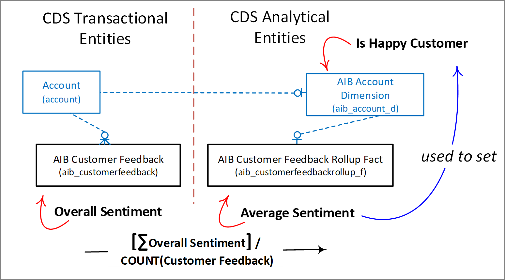

> **Progression goals**

1. Create *Customer Feedback Rollup Fact* analytical entity
2. Aggregate *Customer Feedback* to *Customer Feedback Rollup Fact*
3. Update **Is Happy Customer**: (*Yes*, *No*, *Neutral*)

At this point in Bob’s journey he has a field, **Is Happy Customer,** populated
with labeled values therefore can use the field to predict any *Not Determined*
values.

Another prerequisite to build a prediction model is to identify the input fields to train the model. Bob recognizes he will need to provide fields that cover all customers: *Accounts*. This field will include customers who provided feedback.
<!-- Verify the above -->

Bob chooses a small set of transactional entities, *Order*, *Order Product*, and
*Invoice* as the initial source of input fields to train his model. Again, being
mindful to minimize any negative impact to the transactional system, and
recognizing he only wants specific measures from each entity, Bob creates three
new analytical entities, adding a relation from each to the *Account Dimension*,
to store aggregate values calculated from their respective transactional entity.
Each new entity, *Order Rollup Fact*, *Order Product Rollup Fact*, and *Invoice
Rollup Fact* are populated by their own dataflow.

> [!NOTE]
> Look at the **AIB Populate Order Rollup Fact**, **AIB Populate Order Product Fact**, and **AIB Populate Invoice Rollup Fact** dataflows to see how each fact entity’s measures were populated.

The following diagram illustrates Bob’s current progression:

> **Progression Goals**

1. Create *Customer Feedback Rollup Fact* analytical entity
1. Aggregate *Customer Feedback* to *Customer Feedback Rollup Fact*
1. Update **Is Happy Customer** (*Yes*, *No*, *Neutral*)

At this point in Bob’s journey he has a field, **Is Happy Customer,** populated
with labeled values therefore can use the field to predict any *Not Determined*
values.

Another prerequisite to build a prediction model is to identify the input fields
to train the model. Bob recognizes he will need to provide fields that cover all
customers, *Accounts*, that also include customers who provided feedback.

Bob chooses a small set of transactional entities, *Order*, *Order Product*, and
*Invoice* as the initial source of input fields to train his model. Again, being
mindful to minimize any negative impact to the transactional system, and
recognizing he only wants specific measures from each entity, Bob creates three
new analytical entities, adding a relation from each to the *Account Dimension*,
to store aggregate values calculated from their respective transactional entity.
Each new entity, *Order Rollup Fact*, *Order Product Rollup Fact*, and *Invoice
Rollup Fact* are populated by their own dataflow.

> [!NOTE]
> Look at the **AIB Populate Order Rollup Fact**, **AIB Populate Order Product Fact**, and **AIB Populate Invoice Rollup Fact** dataflows to see how each fact entity’s measures were populated.

The following diagram illustrates Bob’s current progression:

> [!div class="mx-imgBorder"]
> 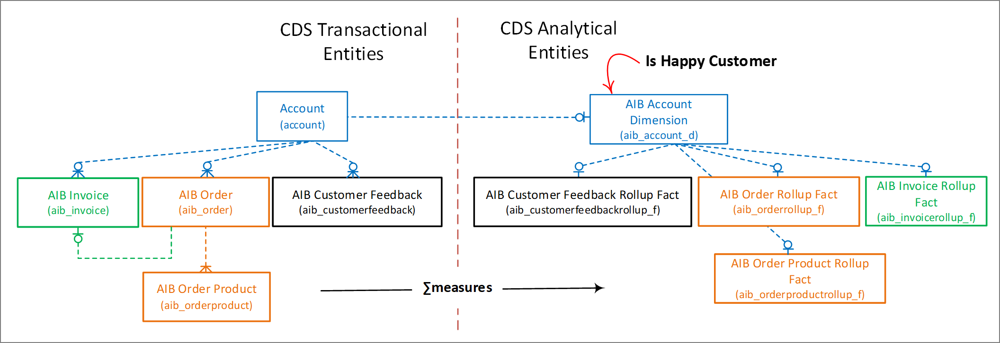

> **Progression goals**

1. Create Transactional Analytical Fact entities
2. Aggregate (∑) Transaction entity’s measures

Now Bob is ready to build his model and refers to [build a prediction
model](https://docs.microsoft.com/en-us/ai-builder/prediction-create-model) to guide his decisions and provide additional insights when building a prediction model.

The following describes Bob’s steps to build his model.

 

After selecting **Prediction** on the  AI Builder Build page, Bob enters the model
name, *Is Happy Customer*, choosing the same name as the field he created the
label values then clicks *Create*.

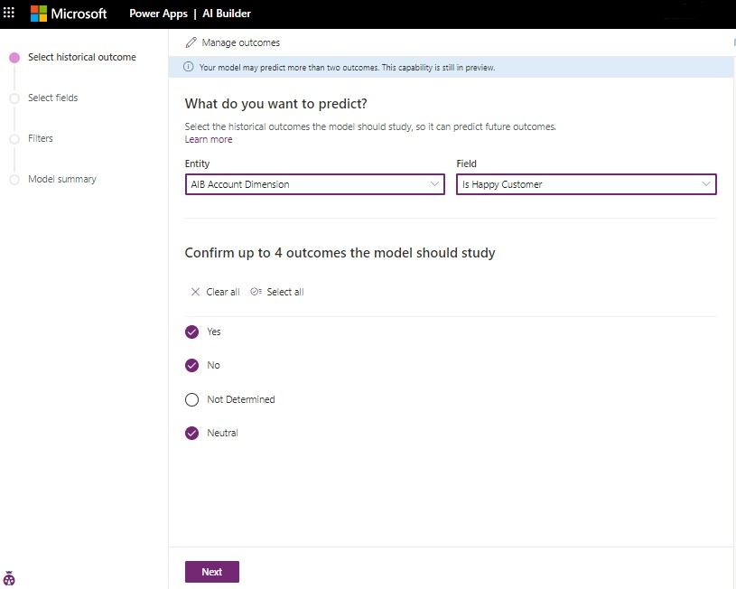

In the next window, Bob is prompted to identify the field containing the labeled
values to predict. Bob chooses *Account Dimension* entity and the *Is Happy
Customer* field after which its *option set* values are presented where Bob
*unchecks Not Determined (the value he wants the model to predict as either Yes,
No, or Neutral)* and verifies the other fields (*Yes*, *No*, *Neutral*) are
checked then selects *Next*.

> [!NOTE]
> When a labeled field has more than two values (empty or null values do not count), the Maker is building a multiclassification model that is expected to be able to predict more than two values. Conversely, if the labeled field had only two values, the Maker is building a binary model that is expected to predict one of the two values (e.g. True or False). At this part of building the model, when presented multiple (more than two) values to predict, the Maker may choose to switch to build a binary model by selecting the Manage Outcomes located above the **What do you want to predict?** header. The Maker must be mindful when making this decision because the Maker will be required to choose which labeled fields are to be assigned *Yes*, *No*, *Ignore*, and to *Predict*.

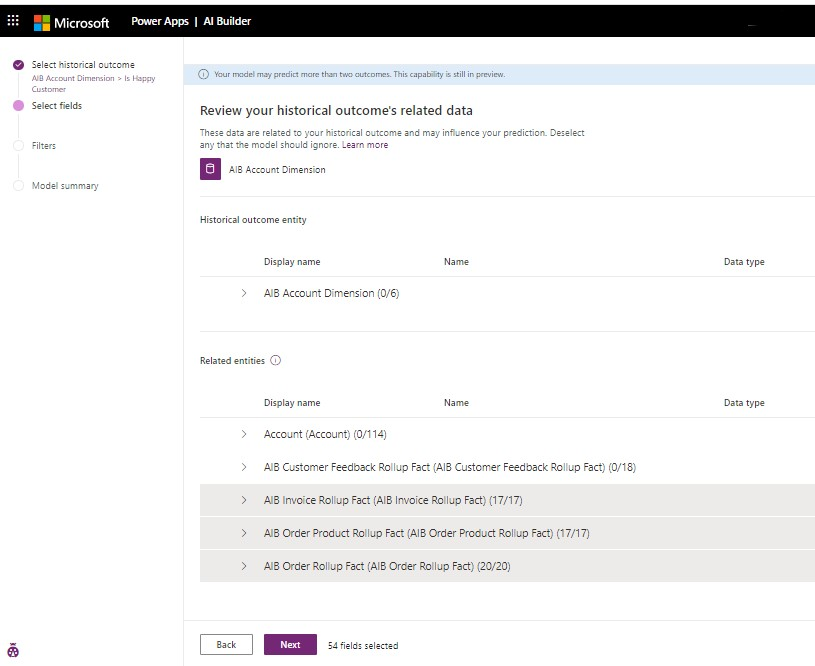

In the next page, Bob is asked to select the fields that will influence the prediction. Because the field he chose to predict existed in *Account Dimension*, he is presented that entity as well as all the Account Dimension’s related source entities.

> [!NOTE]
>These are recognized as the Lookup fields in Account Dimension, which is all the entities it is direct connected as shown in the [CDS Entities](#common-data-service-entities) entity diagram.

Bob’s reasoning when choosing fields is as follows:

> [!NOTE]
> See [Guide to Choosing Features](#guide-to-choosing-features) for additional insights.

| **Entity**                    | **Reasoning**                                                                                                                                                                                                                                                                                                                                                                                                                |
|-------------------------------|------------------------------------------------------------------------------------------------------------------------------------------------------------------------------------------------------------------------------------------------------------------------------------------------------------------------------------------------------------------------------------------------------------------------------|
| Account Dimension             | In the current scope, Bob only has one field, the **Is Happy Customer**, which is the field to be predicted. While others may show, these are not business-related fields and therefore would not add value to train his model.                                                                                                                                                                                              |
| Account                       | Bob wanted to avoid using any transactional entities, including the *Account* to be mindful not to cause any negative impact to the transaction systems. The *Account* may be a good source to train a model using for example the geo related fields. In the future, Bob can easily add *Account* specific fields to the *Account Dimension* and either retrain his model or create another version to compare the results. |
| Customer Feedback Rollup Fact | Would cause “Leakage” if the model is trained from data that wouldn’t (or shouldn’t) be available. This data was used to create label values and therefore would cause the model to look better than it really is.                                                                                                                                                                                                           |
| Order Rollup Fact             | Like all of the analytical fact entities, Bob does not know which measure fields provide the most influence to create a prediction, therefore he chooses all the fields, relying on AI Builder’s Featurizer (an internal module) to drop corelated fields before training and then see which of the remaining fields made the *Most Influential data* list when trained.                                                     |
| Order Product Rollup Fact     | Same decision as decision noted in Order Rollup Fact.                                                                                                                                                                                                                                                                                                                                                                        |
| Invoice Rollup Fact           | Same decision as decision noted in Order Rollup Fact.                                                                                                                                                                                                                                                                                                                                                                        |

Based on his reasoning, Bob unchecks the *Account Dimension*’s, the *Account* fields, and the *Customer Feedback Rollup Fact*’s fields. Not knowing which fields to
choose from the remaining analytical entities, he chooses all the fields located
in the *Order Rollup Fact*, *Order Product Rollup Fact*, and *Invoice Rollup
Fact* entities then selects *Next*.

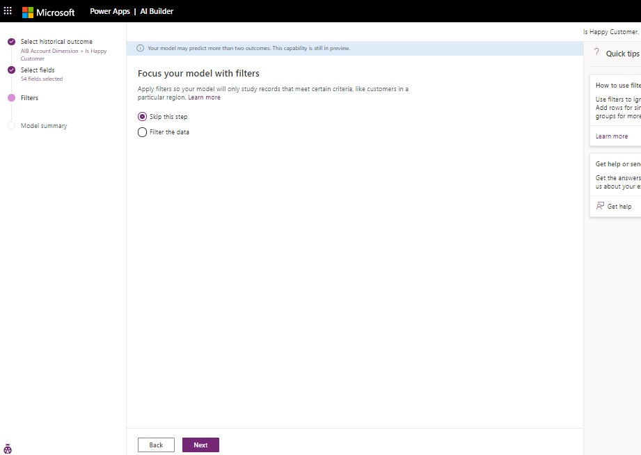

Bob clicks **Next**, accepting the default to skip the step to **Focus your model
with filters**.

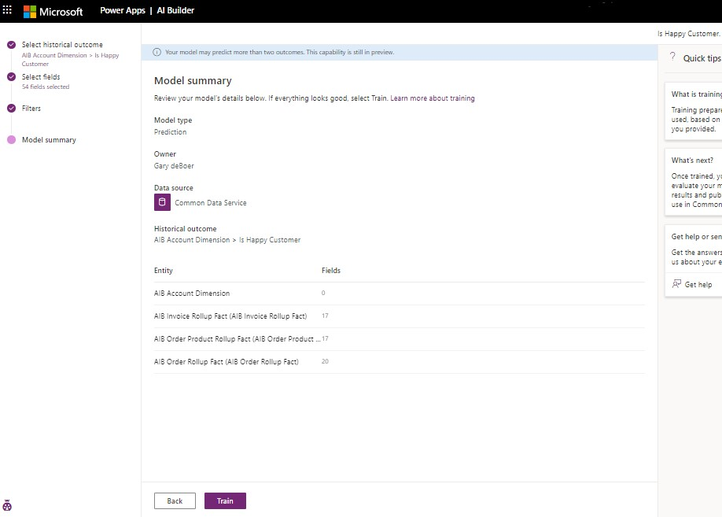

On the *Model Summary* page, Bob verifies his choices and after confirming
they are correct clicks *Train…*

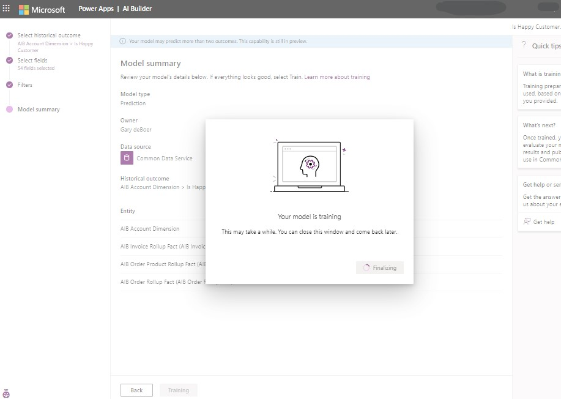

This triggers a message stating, “Your mode is training”, and that he can close
the window.

Bob closes the page.

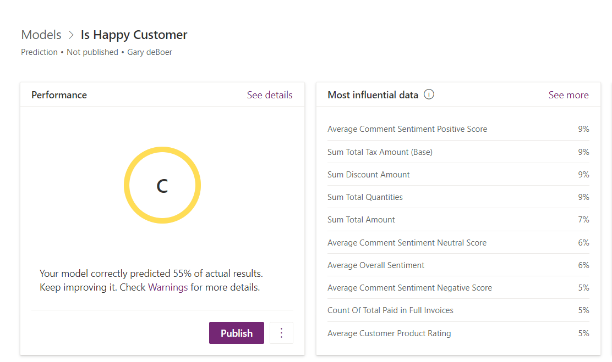

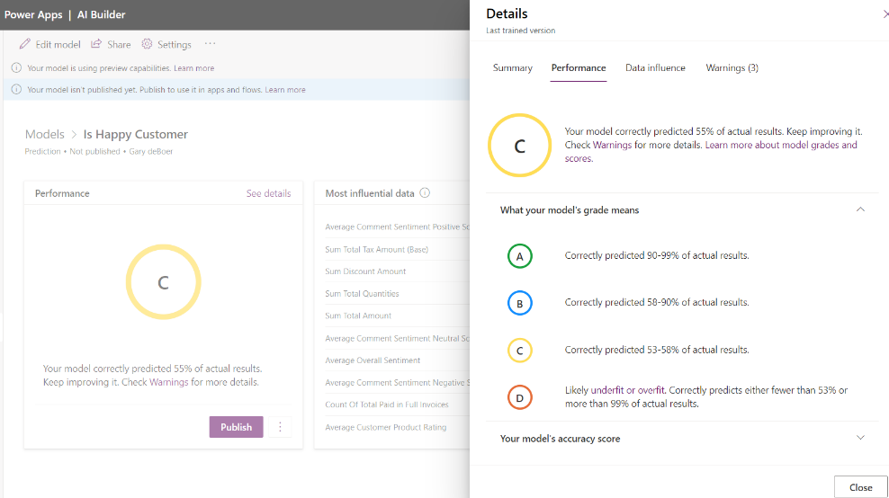

Bob opens the *AI Builder Models* page and locates his model, *Is Happy
Customer*. When it shows *Trained*, Bob opens the model.

Not expecting an acceptable model on his first attempt, Bob is surprised that
the model’s performance received a *C* grade with 55% prediction accuracy and
when he opens “See details” it shows the score in the middle range of C. Wanting
to improve the performance, Bob reviews the *Most influential data* as a
guideline to see which fields he should consider out of the original large
number of input fields to retrain his model.

Bob selects *Edit model* to narrow the set of fields to train the
model.

> [!NOTE]
>
> * Another option is to keep the existing trained model and instead build another model, with a different name, that then can be compared to the previous  model(s) to assist when choosing fields and targeting the best model.
>
> * To produce this model, it required a few intermediate experiments. While it is AI Builder’s goal to produce the best model on the first training, knowing meaning of your business may provide improved results.

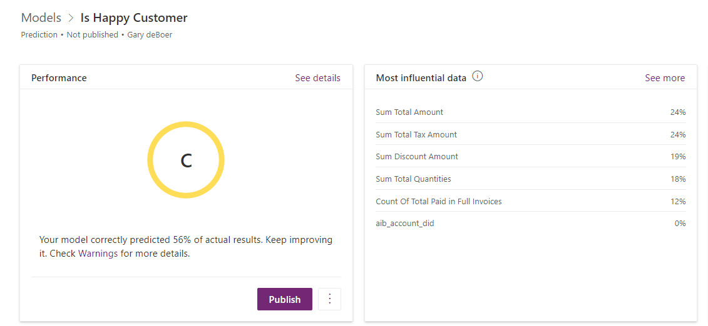

After the model is retrained, Bob sees that the grade hasn’t changed but the
percentage accuracy increased just on the cusp to be elevated to B. Liking the
results, Bob clicks *Publish*.

Once published, Bob will incorporate the new **Is Happy Customer** prediction
fields added to the *Account Dimension* in his [Customer Satisfaction canvas
application](#powerapp-canvas-application-aib-customer-satisfaction).

### Model enhancement considerations

For your business, consider including other customer related entities from
different areas of the business such as:

* Customer Service that addresses the day-to-day challenges customers face with your products or services.
* Sales that engage customers in pre- or post-sales activities
* Usage that tracks customer’s usage activity
* Product Diagnostics that identify and log outages or lower than expected  services. This is not a direct link to your customers but can serve as an indirect link that can predict an effect due to unplanned and undesired events.

## Power App canvas application – AI Builder customer satisfaction

With a published model, *Is Happy Customer*, Bob will be able to incorporate the
model in a PowerApp Canvas application to view the results from the prediction
and dive into specific customer details.

The following image shows the *Customer Satisfaction* canvas application
that list all customers along with the **Is Happy Customer**, **Is Happy
Customer – Predicted**, and **Is Happy Customer – Probability** field values. As
the image illustrates, customer Ira Kirk is a happy customer yet there are no
values for **Is Happy Customer – Predicted** and **Is Happy Customer –
Probability**. This is because Ira provided Customer Feedback and therefore his
**Is Happy Customer** value was calculated through sentiment analysis and since
his happiness is assigned and was used as input to train the model, he would not
have a predicted value. Whereas Cleo Waller whose **Is Happy Customer** value is
*Not Determined* shows values of Yes and 0.96 for **Is Happy Customer –
Predicted** and **Is Happy Customer – Probability** respectfully. That is, the
model predicted Cleo as Happy.

Bob added links that allow him to dive deeper into any of the customers to see
additional customer details in any of the related entities.

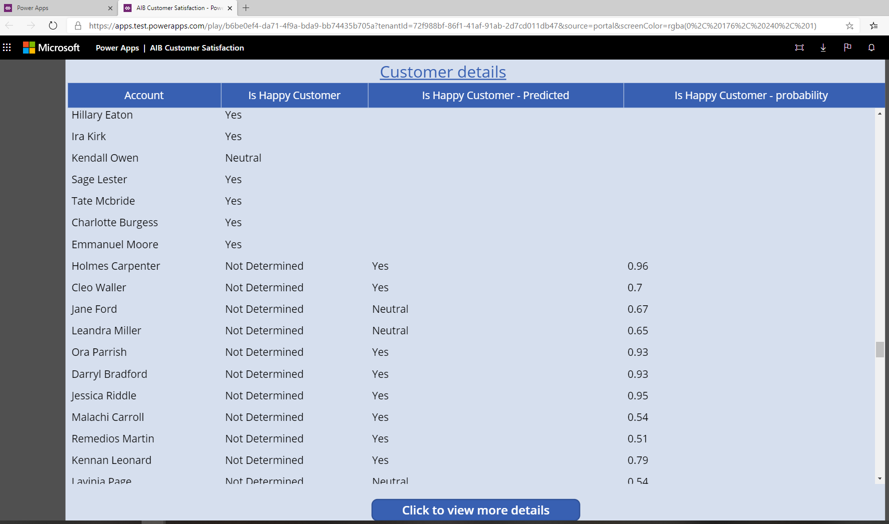

## Starter Kit Configuration Steps

In this section, we'll configure the starter kit in your environment:

> [!NOTE]
> It is recommended that you create a new environment or use a test environment to keep your production environment clean and avoid adding test\\sample. Refer section “Provisioning a new environment” here: [create-environment](https://docs.microsoft.com/en-us/power-platform/admin/create-environment)

Create an environment:

1. Unpackage the *AIBCustomerSatisfaction.zip.* file. 
1. Import the solution package by following the steps in the [Import Solutions](https://docs.microsoft.com/en-us/powerapps/maker/common-data-service/import-update-export-solutions)  documentation.
    * The solution file *AIB CustomerSatisfactionSolution.zip* can be found in
        the package folder.
1. Import transactional data by following the steps in the [Import Data using
    the Configuration Migration
    Tool](#import-data-using-the-configuration-migration-tool-cmt) section.
1. Populate the analytical data by configuring and running the dataflows
    following the steps in the “[Configure and run
    Dataflows](#configureandrundataflows)” section for the following dataflows:

    * AIB Populate Customer Feedback Rollup Fact
    * AIB Populate Order Rollup Fact
    * AIB Populate Order Product Rollup Fact
    * AIB Populate Invoice Rollup Fact

1. Configure and execute the following Power Automate flow by following the steps outlined in the [Configure and Run PowerAutomate Flows](#configure-and-run-power-automate-flows) section.

   * AIB update Account Dimension

    > [!NOTE] Execute this only after successful completion of all the above-mentioned dataflows!

1. Optionally, you can run the following Power Automate flows to get hands-on experience running the Sentiment analysis model against the customer feedback and order product comments.

   > [!NOTE] These were executed, therefore already populated, when you imported the transactional data following the steps in the **Import Data Using the CMT Tool** section.

   * AIB Execute Sentiment Analysis Customer Feedback
   * AIB Execute Sentiment Analysis Order Product
   * AIB Execute Sentiment Analysis Customer Feedback-Internal (Do not execute)

   > [!IMPORTANT] *Don’t execute the customer feedback-internal flow!* Just configure to make sure connections are set as per new environment. This is called by *AIB Execute Sentiment Analysis Customer Feedback.*

## Import Data using the Configuration Migration Tool (CMT)

In this section, we'll import the starter kit’s sample data into
the transactional entities.

1. Download the CMT NuGet package from NuGet’s [Dynamics 365 Configuration Migration Tool](https://www.nuget.org/packages/Microsoft.CrmSdk.XrmTooling.ConfigurationMigration.Wpf) web page.
2. Rename the Nuget file extension from: “.nupkg” to “.zip”.
3. Unzip the renamed file.
4. Run “DataMigrationUtility.exe" located in the “tools” folder which opens the following screen:

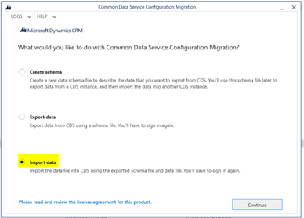

1. Select the “Import data” option then select “Continue” to display the following screen:

1. Select “Office 365” as deployment type .

1. Select “Sign in as current user” option to login as current user *or* select **Show Advanced** to enter different user credentials.
1. Select “Display list of available organization” option.
1. Select “Login” to move on to the next dialog window.

1. Select your target environment where the transactional sample data will be
1. Select “Login” to move on to the next dialog window.

1. Download the AIBCustomerSatisfactionSampleData.zip file from <https://go.microsoft.com/fwlink/?linkid=2133095>
1. After you verify that you are connected to the correct environment, select the “…” then choose the import data file **AIBCustomerSatisfactionSampleData.zip**. Then, select **Import data**” to start the import shown in the following screen.

You should see something like this with no errors. You can minimize but *do not close this window* until the import completes.

   > [!IMPORTANT] Do not close this window while the import is running! It will take approximately five (5) hours to complete. If you close the window before the import completes, you will need to restart the import starting at step 1.

## Configure and run dataflows

Each starter kit dataflow must be reconfigured to point to your organization’s
uniform record locator (URL) known as the “Organization URL” or “Service Root URL”. Your organization URL can be found by following the steps mentioned here: [View or download developer resources](https://docs.microsoft.com/en-us/powerapps/developer/common-data-service/view-download-developer-resources).

Follow these steps in Power Apps to configure each dataflow.

1. On the left-side of your Power Apps, expand “Data” then select “Dataflows”
    to view the existing dataflows. You should see dataflows similar to those
    shown in the image above.
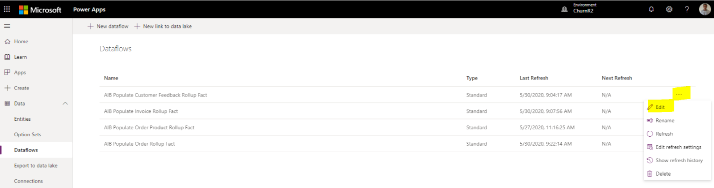
1. At the end of each dataflow row is a “…”. Select the “…” to configure the
    dataflow, and then select **Edit**.

1. Select the “Advanced editor” Query option. This opens the advanced editor.

1. Modify with your organization’s URL (Service Root URL) between the set of
    double quotes (“ ”). This appears after ‘*Source = OData.Feed(’* text. Then,
    select “OK” when you’re done to go back to the *Power Query* screen.
    1. Example

> The “https://org646c0a84.api.crm10.dynamics.com/api/data/v9.1/” shown above
> needs to be replaced with your Organization URL.

1. Select “Configure Connection” to enter your organization credentials.

1. Select **Organizational Account** on the **Authentication Kind** drop down menu, and then select “Sign in” and complete the sign in process.

> You should see a “you are currently signed in.” message just above **Sign
> in as a different user**.

1. Select **Connect**.

You should see something like this screen showing data rows from the source entity the dataflow will be reading to populate the corresponding fact entity. Yours may be different depending on the dataflow you are configuring.

1. Select **Next**

1. In this window:

    a.  Under **Load Settings** select **Load to existing entity**.

    b.  Select the appropriate entity in the **Destination entity** menu.

    c.  Select the **Delete rows that no longer exist in the query output** option

    d.  Under **Field mapping**, map the *Source columns* to *Destination fields* based on the chosen *Destination entity*, then select *Next*. Refer to the [Dataflow Mapping
            Table](#dataflow-mapping-table) below for details.

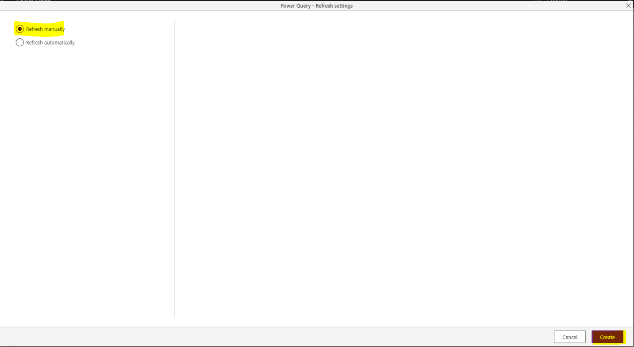

1. Select **Refresh manually** then click **Create**.

> You should see something like the above where **Next Refresh** should show
> **In progress** for the respective dataflow you had just configured.

1. Select the “…” located far right of the dataflow name and choose **Show refresh history** to view the status of the run.

> You should see something like the above. Click “Close”.

## Dataflow mapping table

Refer to the following table to complete mapping the dataflow fields. Columns not
mentioned should be mapped to (none)).

| **Dataflow**                               | **Load setting Destination Entity** | **Field Mapping**                         |                                           |
|--------------------------------------------|-------------------------------------|-------------------------------------------|-------------------------------------------|
|                                            |                                     | **Source column**                         | **Destination field**                     |
| AIB Populate Customer Feedback Rollup Fact | aib_customerfeedbackrollup_f        | aib_accountid                             | aib_accountid                             |
|                                            |                                     | Average Feedback Sentiment Negative Score | aib_averagefeedbacksentimentnegativescore |
|                                            |                                     | Average Feedback Sentiment Neutral Score  | aib_averagefeedbacksentimentneutralscore  |
|                                            |                                     | Average Feedback Sentiment Positive Score | aib_averagefeedbacksentimentpositivescore |
|                                            |                                     | Average Sentiment                         | aib_averagesentiment                      |
|                                            |                                     | Average Sentiment Negative Score          | aib_averagesentimentnegativescore         |
|                                            |                                     | Average Sentiment Neutral Score           | aib_averagesentimentneutralscore          |
|                                            |                                     | Average Sentiment Positive Score          | aib_averagesentimentpositivescore         |
|                                            |                                     | Average Subject Sentiment Negative Score  | aib_averagesubjectsentimentnegativescore  |
|                                            |                                     | Average Subject Sentiment Neutral Score   | aib_averagesubjectsentimentneutralscore   |
|                                            |                                     | Average Subject Sentiment Positive Score  | aib_averagesubjectsentimentpositivescore  |
|                                            |                                     | Count Of Total Feedbacks                  | aib_counttotalfeedbacks                   |
| AIB Populate Order Rollup Fact             | aib_orderrollup_f                   | aib_accountid                             | aib_accountid                             |
|                                            |                                     | Count Total Orders                        | aib_counttotalorders                      |
|                                            |                                     | Count Total Promotions                    | aib_counttotalpromotions                  |
|                                            |                                     | Sum Discount Amount                       | aib_sumdiscountamount                     |
|                                            |                                     | Sum Total Amount                          | aib_sumtotalamount                        |
|                                            |                                     | Sum Total Initial Price Amount            | aib_sumtotalinitialpriceamount            |
|                                            |                                     | Sum Total PreTax Amount                   | aib_sumtotalpretaxamount                  |
|                                            |                                     | Sum Total Tax Amount                      | aib_sumtotaltaxamount                     |
| AIB Populate Order Product Rollup Fact     | aib_orderproductrollup_f            | aib_accountid                             | aib_accountid                             |
|                                            |                                     | Average Comment Sentiment Negative Score  | aib_averagecommentsentimentnegativescore  |
|                                            |                                     | Average Comment Sentiment Neutral Score   | aib_averagecommentsentimentneutralscore   |
|                                            |                                     | Average Comment Sentiment Positive Score  | aib_averagecommentsentimentpositivescore  |
|                                            |                                     | Average Customer Product Rating           | aib_averagecustomerproductrating          |
|                                            |                                     | Average Overall Sentiment                 | aib_averageoverallsentiment               |
|                                            |                                     | Count Customer Product Ratings            | aib_countcustomerproductratings           |
|                                            |                                     | Sum Total Amount                          | aib_sumtotalamount                        |
|                                            |                                     | Sum Total Quantities                      | aib_sumtotalquantities                    |
| AIB Populate Invoice Rollup Fact           | aib_invoicerollup_f                 | aib_accountid                             | aib_accountid                             |
|                                            |                                     | Count Of Total Billed Invoices            | aib_counttotalbilled                      |
|                                            |                                     | Count Of Total Canceled Invoices          | aib_counttotalcanceled                    |
|                                            |                                     | Count Of Total Invoices                   | aib_counttotalinvoices                    |
|                                            |                                     | Count Of Total Paid in Full Invoices      | aib_counttotalpaidinfull                  |
|                                            |                                     | Count Of Total Paid Partial Invoices      | aib_counttotalpaidpartial                 |
|                                            |                                     | Sum Total Amount                          | aib_sumtotalamount                        |
|                                            |                                     | Sum Total Tax Amount                      | aib_sumtotaltaxamount                     |

## Configure and run Power Automate flows

Each starter kit Power Automate flow requires configuration of each connector credentials to remove all warnings.

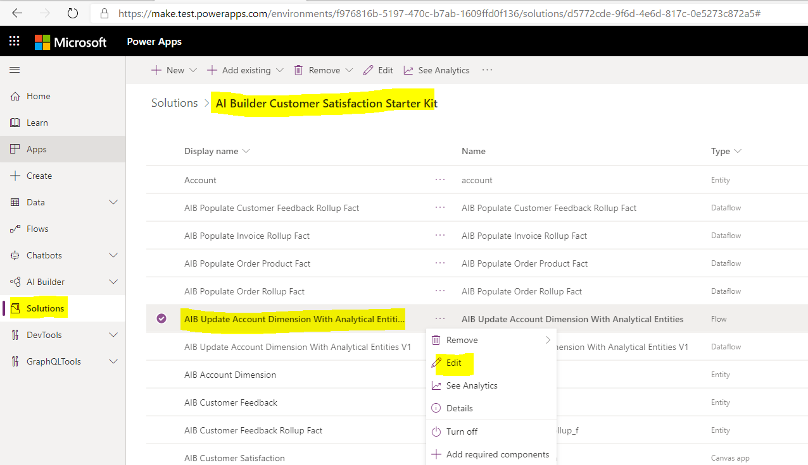

1. Select **Solutions** located on the left panel to open the *Solutions* page.
2. Select the **AI Builder Customer Satisfaction Starter Kit** solution to open
    the solution page.
3. Identify the flow to configure and select the “…” left of the flow’s display
    name.
4. In the popup dialog window select “Edit” to open the flow editor.

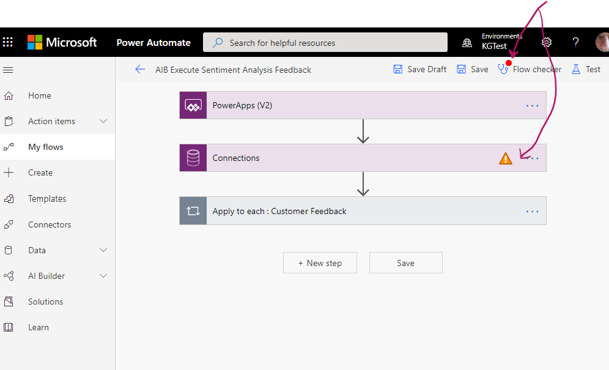

A solid red dot in front of “Flow Checker” indicates there is an issue with the
flow that requires correction. In the image you can also see the warning symbol
which indicates there is an issue in that location. You will need to expand the
Connection to see the issue.

> When the connection is expanded, as shown above, you will see the message,
> in this case, “Invalid connection”.

1. Select “+*Add new connection** to complete the sign-in process.
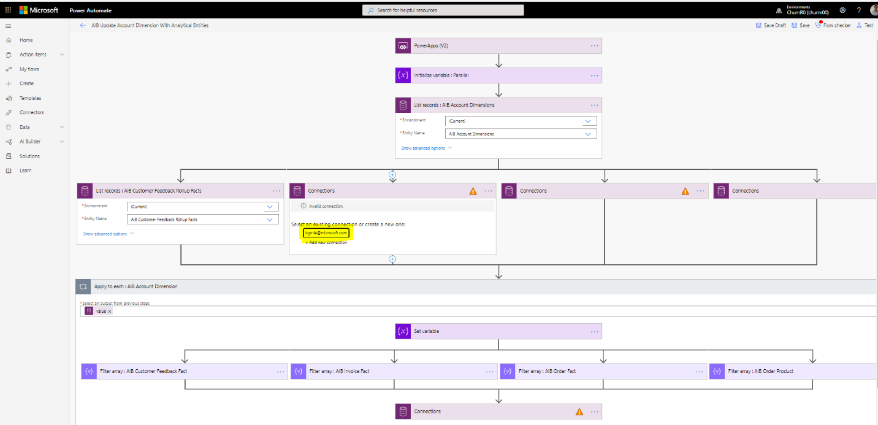

1. After you update the first control, each connector that requires a     connection, you can select your existing connection. If the existing connection does not exist, then you have to create a new one. Do this for all warnings until the red dot in front of the “Flow checker” disappears, indicating there are no more issues with the flow.

You should see something like this when no warnings appear.

1. Once updated, select **Save** on the top right corner.
2. Select the left arrow to the left of **Save**.

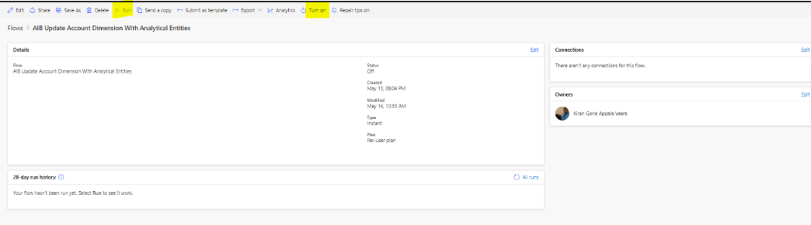

1. Select **Turn on** (if you do not see this then expand the “…”) to enable the flow.
2. Once enabled, select **Run**.

## How to customize the customer satisfaction canvas application to display the published model results

Use the following guidelines to customize the customer satisfaction canvas app
to display the published model results.

1. Sign in to your Power Apps environment

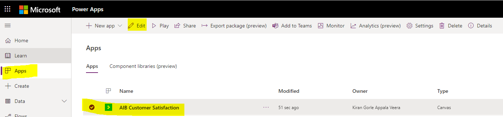

1. Located on the left panel, select “Apps”
2. Select “AIB Customer Satisfaction” then select “Edit” above

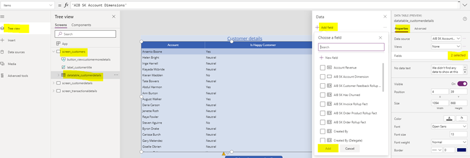

1.  On the left panel, select “Tree view”
2.  Under “Tree view” l, select “screen_customers” then select
    “datatable_customerdetails”
3.  On the far-right side properties panel, select the “selected” link and
    choose the new fields that were created by publishing the Is Customer Happy
    model:
    1.  aib_is_customer_happy_predicted
    2.  aib_is_customer_happy_probability
4.  Under the **Data** panel, select **Add** to save the changes.

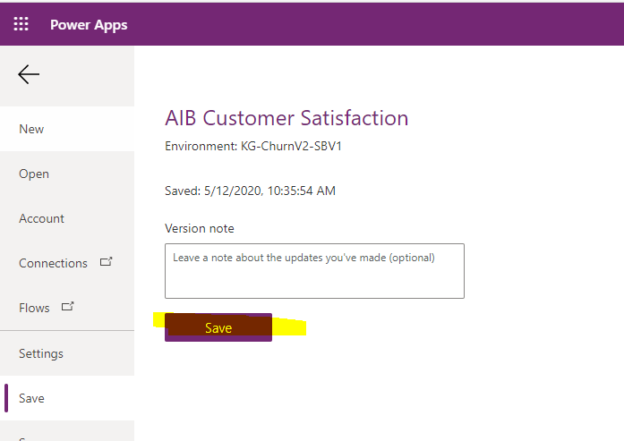

1.  Select “File” at the top of your screen, then select “Save”.

1.  Select “Publish” to publish the changes

How to use the Power App AIB Customer Satisfaction application
==============================================================

Follow the steps below to navigate the Customer Satisfaction app.

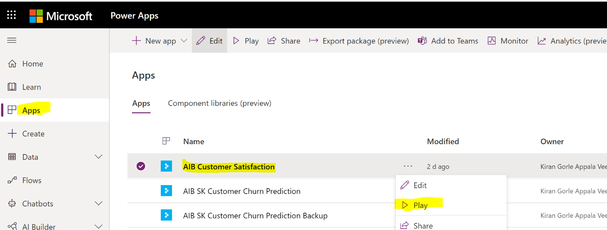

1. Sign in to your PowerApps studio
2. Select “Apps” on left side
3. Select **AIB Customer Satisfaction** then select **Play**

> Customer Details - Shows all customers/accounts.

1. Select any customer/account and **Select to view more details** to view the
    analytical details.

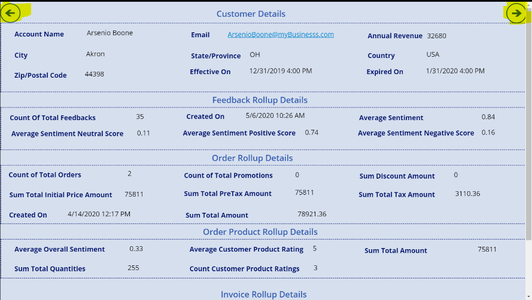

> Analytical details – Shows all aggregate details about the
> accounts/customer.

1. Use the top *left* arrow to navigate back to Customer Details screen, or
    *right* arrow to see transaction details.

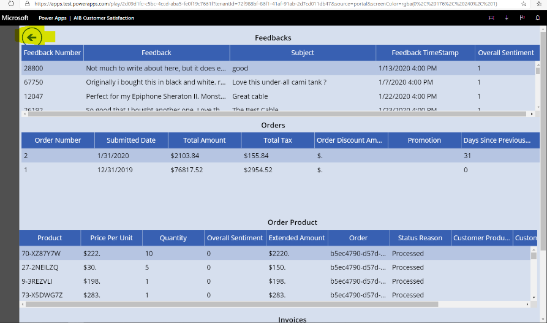

> A screenshot of a computer screen Description automatically generated

> Transaction details - Shows all transaction details for deeper analysis.

1. Use top left arrow to go back to analytical details.

## Appendix

### Starter Kit Common Data Service entity fields

#### Account – Adds the following custom fields:

| **Display Name**         | **Physical Name**      | **Values** |
|--------------------------|------------------------|------------|
| AIB Account Effective On | aib_accounteffectiveon |            |
| AIB Account Expired On   | aib_accountexpiredon   |            |

#### AIB Customer Feedback

| **Display Name**                  | **Physical Name**                  | **Values**                                         |
|-----------------------------------|------------------------------------|----------------------------------------------------|
| AIB Customer Feedback             | aib_customerfeedbackid             |                                                    |
| Account                           | aib_accountid                      |                                                    |
| Subject                           | aib_subject                        |                                                    |
| Feedback                          | aib_feedback                       |                                                    |
| Overall Sentiment                 | aib_overallsentiment               |                                                    |
| Subject Sentiment Positive Score  | aib_subjectsentimentpositivescore  |                                                    |
| Subject Sentiment Neutral Score   | aib_subjectsentimentneutralscore   |                                                    |
| Subject Sentiment Negative Score  | aib_subjectsentimentnegativescore  |                                                    |
| Feedback Sentiment Positive Score | aib_feedbacksentimentpositivescore |                                                    |
| Feedback Sentiment Neutral Score  | aib_feedbacksentimentneutralscore  |                                                    |
| Feedback Sentiment Negative Score | aib_feedbacksentimentnegativescore |                                                    |
| Average Sentiment Positive Score  | aib_averagesentimentpositivescore  |                                                    |
| Average Sentiment Neutral Score   | aib_averagesentimentneutralscore   |                                                    |
| Average Sentiment Negative Score  | aib_averagesentimentnegativescore  |                                                    |
| Status Reason                     | statuscode                         | Active Inactive Created Reviewed Replied Completed |

### AIB Order

| **Display Name**                                                                                           | **Physical Name**           | **Values**                                          |
|------------------------------------------------------------------------------------------------------------|-----------------------------|-----------------------------------------------------|
| AIB Order                                                                                                  | aib_orderid                 |                                                     |
| Account                                                                                                    | aib_accountid               |                                                     |
| Order Number                                                                                               | aib_ordernumber             |                                                     |
| Submitted Date                                                                                             | aib_submitdate              |                                                     |
| Order Photo URL                                                                                            | aib_orderphotourl           |                                                     |
| Promotion                                                                                                  | aib_promotion               |                                                     |
| Total Initial Price Amount *Value equals the sum of Order Product Extended Amount by order*                | aib_totalInitialPriceAmount |                                                     |
| Order Discount Percentage                                                                                  | aib_discountpercentage      |                                                     |
| Total PreTax Amount *Value after multiplying the Order Discount Percentage to Total Initial Price Amount*  | aib_totalpretaxamount       |                                                     |
| Tax Rate                                                                                                   | aib_taxrate                 |                                                     |
| Total Tax *Value after applying the Tax Rate to the Total PreTax Amount*                                   | aib_totalTax                |                                                     |
| Total Amount *Value after adding the Total Tax and the Total PreTax Amount*                                | aib_totalAmount             |                                                     |
| Status Reason                                                                                              | statuscode                  | Active Inactive Created Processed Shipped Completed |

### AIB Order Product

| **Display Name**                                                            | **Physical Name**                  | **Values**                                          |
|-----------------------------------------------------------------------------|------------------------------------|-----------------------------------------------------|
| AIB Order Product                                                           | aib_orderproductid                 |                                                     |
| Order                                                                       | aib_orderid                        |                                                     |
| Line Item Number                                                            | aib_lineitemnumber                 |                                                     |
| Product                                                                     | aib_productid                      |                                                     |
| Quantity                                                                    | aib_quantity                       |                                                     |
| Price Per Unit                                                              | aib_priceperunit                   |                                                     |
| Extended Amount *Value equals the Quantity multiple by the Price Per Unit.* | aib_extendedamount                 |                                                     |
| Days Since Previous Product Order                                           | aib_dayssincepreviousproductorder  |                                                     |
| Customer Product Rating                                                     | aib_customerproductrating          |                                                     |
| Customer Product Comment                                                    | aib_customerproductcomment         |                                                     |
| Customer Product Rating TimeStamp                                           | aib_customerproductratingtimestamp |                                                     |
| Comment Positive Negative Score                                             | aib_sentimentpositivescore         |                                                     |
| Comment Sentiment Neutral Score                                             | aib_sentimentneutralscore          |                                                     |
| Comment Sentiment Negative Score                                            | aib_sentimentnegativescore         |                                                     |
| Overall Sentiment                                                           | aib_OverallSentiment               |                                                     |
| Status Reason                                                               | aib_orderproduct_statuscode        | Active Inactive Created Processed Shipped Completed |

###  AIB Invoice

| **Display Name**                                   | **Physical Name**       | **Values**                                                 |
|----------------------------------------------------|-------------------------|------------------------------------------------------------|
| AIB Invoice                                        | aib_invoiceid]          |                                                            |
| Account                                            | aib_accountid]          |                                                            |
| Invoice ID                                         | aib_invoicenumber]      |                                                            |
| Invoice Billed Date                                | aib_invoicebilleddate]  |                                                            |
| Bill To Name                                       | aib_billtoname]         |                                                            |
| Contract                                           | aib_salesorderid]       |                                                            |
| Date Delivered                                     | aib_datedelivered]      |                                                            |
| Due Date                                           | aib_duedate]            |                                                            |
| Total Tax *Value equals the Order Total Tax*       | aib_totaltax]           |                                                            |
| Total Amount *Value equals the Order Total Amount* | aib_totalamount]        |                                                            |
| Invoice Paid Date                                  | aib_Iinvoicepaiddate]   |                                                            |
| Invoice Photo Url                                  | aib_invoicephotourl]    |                                                            |
| Status Reason                                      | aib_invoice_statuscode] | Active Billed Paid In Full Paid Partial Cancelled Inactive |

### Account Dimension

| **Display Name**                     | **Physical Name**                                | **Values**                    |
|--------------------------------------|--------------------------------------------------|-------------------------------|
| AIB Invoice                          | aib_ishappycustomer                              | Yes No Neutral Not Determined |
| Is Happy Customer                    | aib_accountid                                    |                               |
| Account                              | aib_customerfeedbackrollup_fid                   |                               |
| AIB Customer Feedback Rollup Fact    | aib_orderrollup_fid                              |                               |
| AIB Order Rollup Fact                | aib_OrderProductRollup_fid                       |                               |
| AIB Order Product Rollup Fact        | aib_invoicerollup_fid                            |                               |
| AIB Invoice Rollup Fact              | aib_ishappycustomer                              |                               |
| Is Happy Customer – Predicted  | new_pred_bb4ed9ee_6196_4491_aa00_c40fd9a3fe0b    |                               |
| Is Happy Customer – Probability  | new_p1\_bb4ed9ee_6196_4491_aa00_c40fd9a3fe0b   |                               |
| Is Happy Customer – Explanation  | new_expl\_bb4ed9ee_6196_4491_aa00_c40fd9a3fe0b |                               |

> *Is Happy Customer – Predicted* field is originally added when the *Is Happy Customer* model is published, but was renamed from the defaulted value **[**e.g. *aib_ishappycustomer - predicted (Is Happy Customer***]** to be easily readable to a human viewer for this SK. The Maker may choose to just accept the default value.
>
> The physical name cannot be renamed, therefore expect to see a string of characters that begins with **new_pred\_** followed by 36 characters (known as a GUID) that represent the identifier of the published model.

>  *Is Happy Customer – Probability* field is originally added when the *Is Happy Customer* model is published but was renamed from the defaulted value [e.g. *aib_ishappycustomer - probability (Is Happy Custom*] to be easily readable to a human viewer.
>
> The physical name cannot be renamed, therefore expect to see a stringof characters that begins with **new_p1\_**.

> **Is Happy Customer – Explanation** field is originally added when the *Is Happy Customer* model is published but was renamed from the defaulted value [e.g. *aib_ishappycustomer - explanation (Is Happy Custom]* to be easily readable to a human viewer.
>
> The physical name cannot be renamed, therefore expect to see a string of characters that begins with **new_expl\_**.

### AIB Customer Feedback Rollup Fact

| **Display Name**                          | **Physical Name**                         |
|-------------------------------------------|-------------------------------------------|
| Average Sentiment                         | aib_AverageSentiment                      |
| Count Of Total Feedbacks                  | aib_counttotalfeedbacks                   |
| Average Subject Sentiment Positive Score  | aib_averagesubjectsentimentpositivescore  |
| Average Subject Sentiment Neutral Score   | aib_averagesubjectsentimentneutralscore   |
| Average Subject Sentiment Negative Score  | aib_averagesubjectsentimentnegativescore  |
| Average Feedback Sentiment Positive Score | aib_averagefeedbacksentimentpositivescore |
| Average Feedback Sentiment Neutral Score  | aib_averagefeedbacksentimentneutralscore  |
| Average Feedback Sentiment Negative Score | aib_averagefeedbacksentimentnegativescore |
| Average Sentiment Positive Score          | aib_averagesentimentpositivescore         |
| Average Sentiment Neutral Score           | aib_averagesentimentneutralscore          |
| Average Sentiment Negative Score          | aib_averagesentimentnegativescore         |
| Account                                   | aib_accountid                             |

### AIB Order Rollup Fact

| **Display Name**               | **Physical Name**              |
|--------------------------------|--------------------------------|
| Sum Total Amount               | aib_sumtotalamount             |
| Sum Total Tax Amount           | aib_sumtotaltaxamount          |
| Sum Total Initial Price Amount | aib_sumtotalinitialpriceamount |
| Sum Discount Amount            | aib_sumdiscountamount          |
| Sum Total PreTax Amount        | aib_sumtotalpretaxamount       |
| Count of Total Orders          | aib_counttotalorders           |
| Count of Total Promotions      | aib_counttotalpromotions       |
| Account                        | aib_accountid                  |

### AIB Order Product Rollup Fact

| **Display Name**                                                                   | **Physical Name**                        |
|------------------------------------------------------------------------------------|------------------------------------------|
| Sum Total Amount Value equals the sum of order product extended amount by account. | aib_sumtotalamount                       |
| Sum Total Quantities                                                               | aib_sumtotalquantities                   |
| Count Customer Product Ratings                                                     | aib_countcustomerproductratings          |
| Average Customer Product Rating                                                    | aib_averagecustomerproductrating         |
| Average Overall Sentiment                                                          | aib_averageoverallsentiment              |
| Average Comment Sentiment Positive Score                                           | aib_averagecommentsentimentpositivescore |
| Average Comment Sentiment Neutral Score                                            | aib_averagecommentsentimentneutralscore  |
| Average Comment Sentiment Negative Score                                           | aib_averagecommentsentimentnegativescore |
| Account                                                                            | aib_accountid                            |

### AIB Invoice Rollup Fact

| **Display Name**                     | **Physical Name**         |
|--------------------------------------|---------------------------|
| Sum Total Amount                     | aib_sumtotalamount        |
| Sum Total Tax Amount                 | aib_sumtotaltaxamount     |
| Count Of Total Invoices              | aib_counttotalinvoices    |
| Count Of Total Billed Invoices       | aib_counttotalbilled      |
| Count Of Total Canceled Invoices     | aib_counttotalcanceled    |
| Count Of Total Paid Partial Invoices | aib_counttotalpaidpartial |
| Count Of Total Paid in Full Invoices | aib_counttotalpaidinfull  |
| Account                              | aib_accountid             |

### Customer Feedback Overall Sentiment – field calculation

The following screen print shows the calculated field, Overall Sentiment, logic.

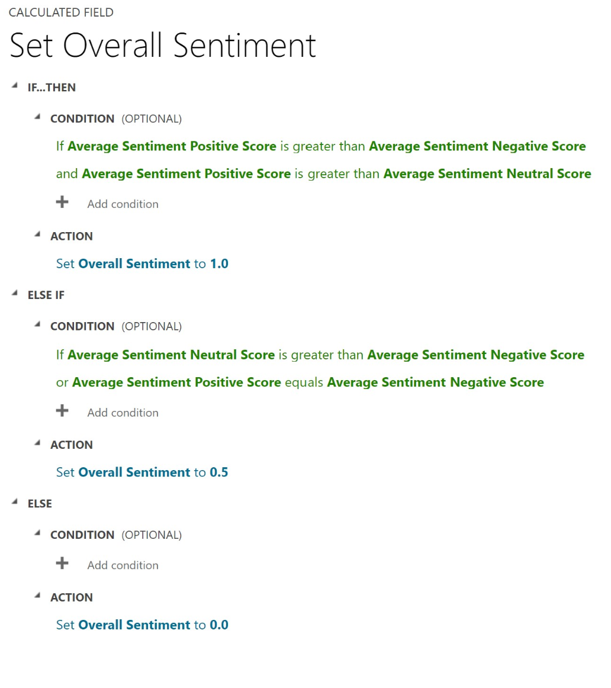

### Guide to choosing features

The following are guidelines to assist field choice decisions.

Referring to the latest to [build a prediction model](https://docs.microsoft.com/en-us/ai-builder/prediction-create-model), use the following guidelines to choose the input fields when creating a prediction.

Do choose:

* Metric fields

    * Quickens the training that a featurizer would most likely create

* Fields that best influence the prediction

    * Initially this is not apparent but becomes evident after repeated
        training experiments

Do not choose:

* Fields that are not available to predict in production

    * Causes overly optimistic if not completely invalid predictive models
        referred as Data Leakage. Bob, therefore, will not choose any fields
        from the Customer Feedback Rollup Fact entity.

* Fields that are highly correlated

    * While these may be eliminated during training, eliminating one of the
        pairs prior to training will reduce training cost and time

* Fields that are duplicates

    * These are also highly correlated fields

    * May exist in the same entity. For example, when a field is currency, a
        “base” field is created as well.

    * May exist across entities.
